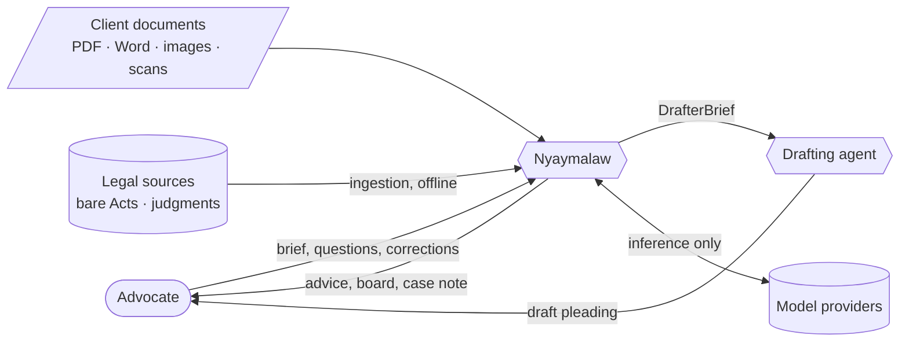
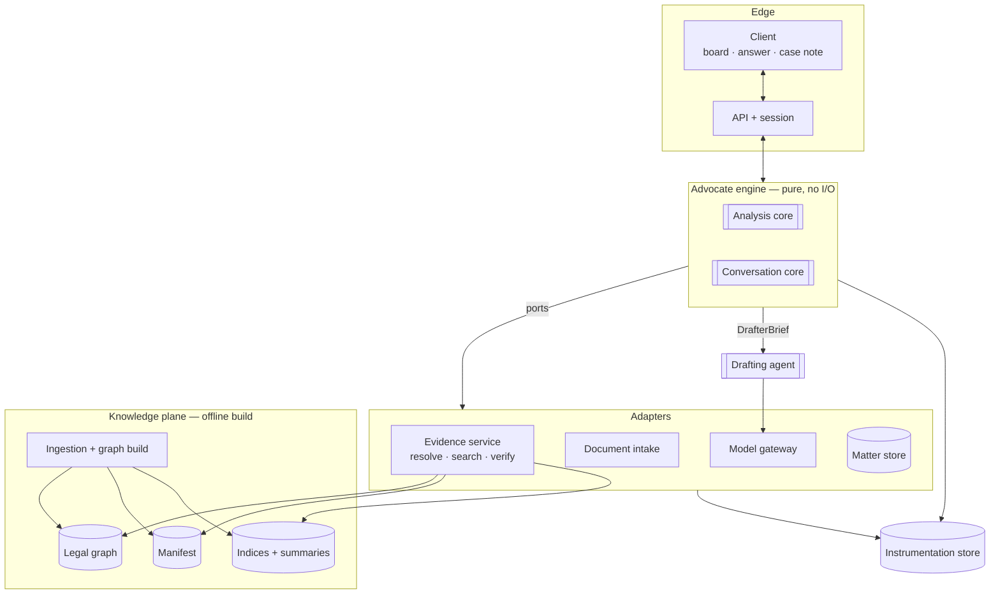
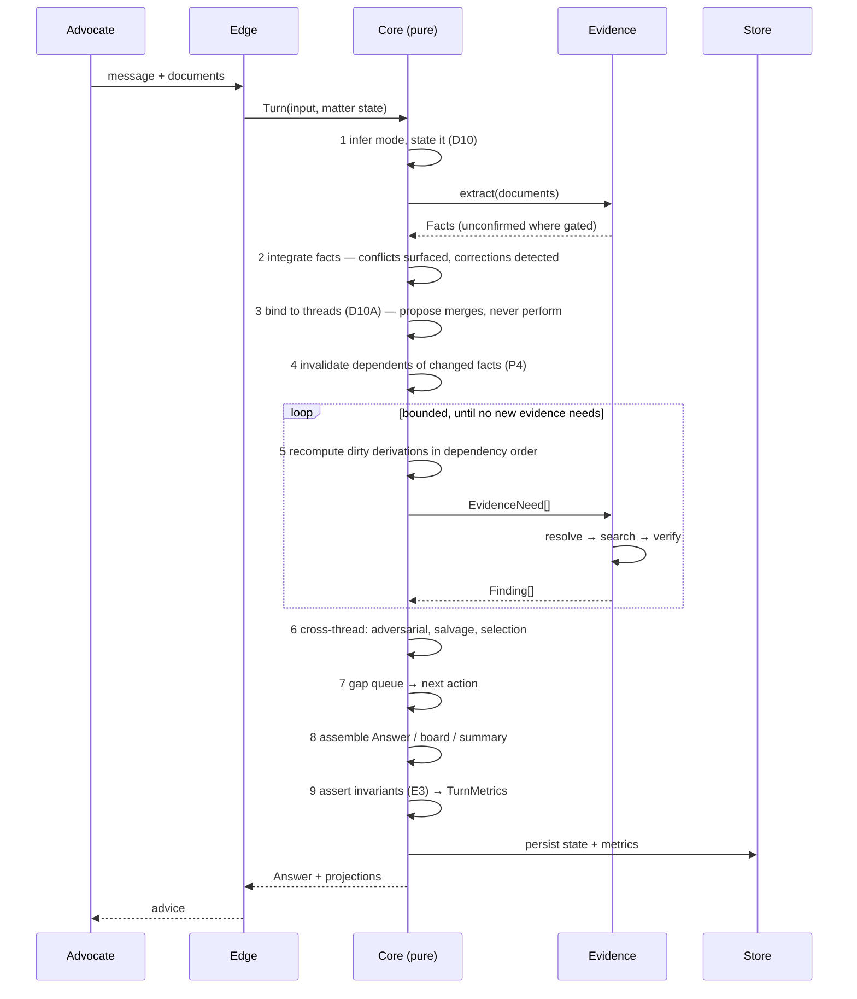

# Nyaymalaw — Architecture

**Derived from `docs/PRD.md`, which is the authority.** Every structure here
cites the rule it exists to satisfy. Where the architecture cannot satisfy a
rule, that is raised as a PRD question — never resolved by quietly weakening the
rule.

**This is a clean design.** The current implementation is not its starting point.
Same discipline as PRD rule 3.

**Status: `decided`.** Nothing here is built or measured (PRD D14A/E7–E8).

## How to read this

No single diagram is an architecture. This document uses **six views**, each
answering a different question, plus the decisions and the cross-cutting
concerns that do not belong to any one view.

| § | View | Answers |
|---|---|---|
| 2 | **Drivers** | what the PRD forces the architecture to be good at |
| 3 | **Principles** | the rules every view obeys, and why |
| 4 | **Context** | what NM touches in the world |
| 5 | **Containers** | what runs, and where trust boundaries fall |
| 6 | **Components** | what lives inside each container |
| 7 | **Information** | the data model — where the PRD's rules become schema |
| 8 | **Runtime** | what happens during a turn |
| 9 | **Development** | module boundaries, dependency rules, build order |
| 10 | **Cross-cutting** | provenance, instrumentation, error policy, versioning |
| 11 | **Decisions (ADRs)** | what was chosen, against what alternative |
| 12 | **Quality scenarios** | how the architecture is held to the PRD's priorities |

---

## 2. Architectural drivers

The PRD's priority order (D2) is the architecture's priority order, and it is
**lexicographic** — a lower priority never buys a higher one.

| Priority | Driver | Imposed by | Architectural consequence |
|---|---|---|---|
| 1 | **Not wrong** | D2, D8 | posture and limitation are *blocking gates*, not steps; `unknown` is a value |
| 2 | **Not missing anything** | D2, D2A | nothing has a delete path; spotting is exhaustive, selection is a visible disposition |
| 3 | **Grounded** | D5, G6 | verification is a gate in the data path, not a review step |
| 4 | Fast and cheap | D2B | no ceiling; every turn instrumented; cost must show what it bought |

Two further drivers are not in the priority list but shape structure as much:

- **Auditability** (D0A, D2A, E3) — the advocate is the corrector, so anything
  the system decides silently is outside the control loop. Structures must make
  decisions *visible by construction*, not by remembering to log them.
- **Evolvability under measurement** (D14A) — the test cadence is a design input.
  A core that cannot run without a corpus and an LLM cannot have class-A tests,
  and without class-A tests the rules are unenforceable at commit time.

---

## 3. Governing principles

Six. Each is justified by a PRD rule, not by taste.

### P1 — Hexagonal: a pure core, adapters at the edges

Analysis is a **pure function** of matter state and verified Findings. Retrieval,
the LLM, storage, documents and presentation are all **adapters** behind ports.

**Why, and it is not architectural fashion.** PRD D14A/E1 defines class A as
tests needing no corpus and no LLM, running every commit in seconds. **That
cadence is only available if the analysis core has no I/O.** A core that reaches
for a database cannot be tested at commit speed, and the PRD's most load-bearing
invariants — posture derivation, the limitation coverage check, disposition
accounting, theory/adverse-fact set comparisons — are all pure logic. Hexagonal
structure is what converts them from aspirations into commit-time tests.

### P2 — Deterministic shell, stochastic core

```
Resolution (deterministic) → Search (stochastic) → Verification (deterministic gate)
```

Model-driven steps are wrapped by deterministic ones on both sides. Resolution
answers what legal structure fixes (G2); search handles only what structure
cannot (G3); verification re-establishes certainty before anything is used (G6).

**Why.** A stochastic stage cannot be trusted to police itself, and every
measured failure in this system's history was a stochastic stage's output taken
at face value — a summary embedding gating an Act out, a scoring table displacing
a governing Article, a model returning a vocabulary nobody validated. Determinism
at the ends means the middle may be wrong without the system being wrong.

### P3 — Dependencies run one way, and a second path is a second standard

Analysis never calls retrieval; it consumes `Finding`s. Drafting never calls
retrieval at all (DR2). Presentation never computes; it renders state.

**Why.** D5's grounding guarantee holds only if there is exactly **one** audit
chain. Two retrieval paths mean two grounding standards and no way to say which
one produced a citation — which is the same reason DR2 forbids the drafter from
retrieving, generalised to every boundary.

### P4 — Matter state is a derivation graph, not a pipeline

Every computed value records what it depends on. A corrected fact invalidates its
dependents and they recompute — **like a spreadsheet, not like a pipeline re-run.**

**Why.** PRD Q10 requires a changed fact to re-derive everything resting on it,
and CS4 requires the change in advice to be visible. A pipeline recomputes
everything (which makes a trivial correction produce a full re-analysis, Q10's
over-application failure) or nothing (which leaves stale conclusions under
corrected facts, the silent failure D0A exists to prevent). A dependency graph
recomputes exactly what changed and can say what changed and why.

### P5 — Fail loud by default; fail closed only on grounding

Invariant violations are **recorded and surfaced**; the answer still ships. The
single exception is a grounding violation (D5, G6), which **gates the output**.

**Why.** D0A makes noise preferable to silence, so nothing is swallowed. But D2
priority 1 says a wrong answer is worse than no answer — and only grounding
failures produce *confidently wrong* output. Everything else degrades the answer
without falsifying it.

### P6 — Contracts carry obligations; boundaries are where rules are enforced or lost

`Finding` (G9) carries binding status, validity, paragraph kind and the
entailment result. `DrafterBrief` (DR1) carries provenance, ranked reliefs and
what not to plead.

**Why.** Returning chunks pushes citation, binding status and paragraph kind to a
consumer that then skips them — which is exactly how counsel's argument comes to
be quoted as a holding. **An obligation not represented in the type crossing the
boundary is an obligation that will be dropped.**

---

## 4. Context view



**Boundaries worth naming.** The advocate is the only source of instructions and
the only corrector. Client documents are **data, never instruction** — an
uploaded file that contains text addressed to the system is treated as content.
Ingestion is offline and never occurs during a turn. The drafting agent is
outside the analysis boundary by design (D12), and receives a brief rather than a
conversation.

---

## 5. Container view



**The core has no arrows into storage or the model.** It declares ports; the
adapters implement them. That is P1, and it is what makes the core runnable in a
test with hand-built inputs.

**The knowledge plane is built offline and read at turn time.** Nothing in a turn
writes to it. That keeps R3/G21's versioning checkable — an artefact's identity
cannot drift mid-conversation.

---

## 6. Component view

| Container | Component | Owns | Must not |
|---|---|---|---|
| Knowledge | **Legal graph** | versioned provisions, judgments, relations | hold matter data |
| Knowledge | **Manifest** | intended vs actual coverage (M1) | be generated from the index |
| Knowledge | **Indices** | lexical + dense structures | select candidates alone (G17) |
| Knowledge | **Summaries** | section-level and holding-level | be cited (G18) |
| Evidence | **Resolution** | structured state → exact provisions | rank by similarity (G2) |
| Evidence | **Search** | what structure cannot determine | exclude on a threshold (G5) |
| Evidence | **Verification** | the gate before use | soften a failure to a caveat (G6) |
| Core | **Matter state** | threads, facts, issues, derivation graph | compute |
| Core | **Analysis** | theory, proof, limitation, adversarial, salvage, selection | retrieve |
| Core | **Conversation** | the gap queue | own a sequence (Q1) |
| Edge | **Presentation** | board, summary, answer | hold state the summary lacks (CS1) |
| Outside | **Drafting** | pleadings from a brief | retrieve (DR2) |
| Everywhere | **Instrumentation** | metrics, diagnostics, invariants | be optional |

---

## 7. Information view — the data model

The rules in the PRD are only as real as the schema that can express them. Each
entity names what it exists for; a field with no rule behind it is not here.

### 7.1 `Derived` — the mixin that makes the cascade possible

The most consequential structure in the design. **PRD Q10 and CS3–CS4 are
impossible without it**: a dependency never recorded cannot be re-derived, and a
stale conclusion under a corrected fact is precisely the silent failure D0A
exists to prevent.

```
Derived:
  depends_on   : [FactId]                              # Q10
  computed_at  : TurnId
  prior        : { value, changed_by: FactId } | null  # CS4 — ONE prior, not a history
  basis        : stated | inferred | computed
```

`prior` is set **only where the change altered a conclusion or advice already
given** (CS4's bound). Everything else overwrites, because the summary is state,
not a transcript (CS2).

### 7.2 `Fact` — the atom

PRD D5, D10, L1–L3.

```
Fact:
  id             : FactId
  statement      : text
  date           : Date | null            # L3 — null means UNDATED, never estimated
  certainty      : documented | asserted  # L2
  provenance     : Provenance             # D10
  confirmed      : { by, at: TurnId } | null   # D10 extraction gate
  material       : bool                   # Q10 bound — only material facts cascade
  conflicts_with : [FactId]               # D10 — never resolved silently
  superseded_by  : FactId | null

Provenance:
  kind     : document | advocate_statement | derived
  document : DocumentId | null
  page     : int | null
  span     : text | null
  turn     : TurnId
```

**`certainty` lives on the Fact, not inferred later.** A limitation computation
resting on a remembered date is a hope, not a position (L2) — and the conclusion
can only say so if the input carried it from the start.

**`confirmed` is nullable, never defaulted true.** An unconfirmed fact is visible
to analysis but cannot support a conclusion.

### 7.3 `Thread`

PRD D6, D10A. **The id is the load-bearing part.**

```
Thread:
  id              : ThreadId       # D10A — generated once, NEVER from the label
  label           : text           # display only, freely mutable
  aliases         : [text]         # every name it is known by
  identifiers     : { case_no?, fir_no?, cheque_no?, survey_no?, registration_no?, ... }
  posture         : Posture
  theory          : Theory | null
  opponent_theory : Theory | null              # T4
  objective       : decree | acquittal | containment | time | leverage | null   # D0 rule 3
  chronology      : [FactId]                   # L1, ordered
  limitation      : { ours: LimitationComputation?, theirs: LimitationComputation? }  # L8
  issues          : [IssueId]
  attacks         : [Attack]                   # D7C
  gates           : Gates                      # computed, §7.9
  deferred        : { reason: text } | null    # Q7 — never silently dropped
```

**`identifiers` is what merges on; `aliases` never is** (D10A). Label similarity
may *propose* a merge; only a decisive identifier or the advocate's confirmation
performs one — the failure is asymmetric, and a wrong merge inverts the advice
while a wrong split only duplicates work.

### 7.4 `Posture`

PRD D8. `side` is a **function of** `role`, never stored independently.

```
Posture (Derived):
  role          : plaintiff | defendant | complainant | accused | petitioner
                | respondent | opposite_party | appellant | applicant
                | decree_holder | judgment_debtor | unknown
  side          : moving | defending | unknown     # DERIVED: f(role)
  opponent      : text | null
  opponent_role : Role | null
  proceeding    : text | null
  stage         : text | null
  source        : FactId | null
  conflicts     : [{ on_record, now_suggested, applied: bool }]
```

**`unknown` is a value, not an absence.** A `null` here would let a downstream
default creep in — the exact defect D8 was written against.

### 7.5 `Issue` — facets, not a track

PRD D8A.

```
Issue (Derived):
  id            : IssueId
  thread        : ThreadId
  statement     : text
  kind          : threshold | substantive | procedural
  effect        : supports | opposes | neutral | unknown   # F1 — f(kind, posture)
  effect_basis  : PostureVersion
  proof         : ProofPosition | null                     # a FACET, not a bucket
  disposition   : Disposition                              # F2
  serves_theory : bool                                     # T3
  provisions    : [FindingId]
  authorities   : [FindingId]
  deadline      : DeadlineId | null

Disposition:
  state  : run | parked | blocked | closed
  reason : text        # required for parked and closed (F2, D2A)
  needs  : [text]      # required for blocked
```

**`effect_basis` is how F1 is enforced rather than merely stated.** Recording the
posture version the effect was computed against means a posture correction
invalidates it automatically, through the same cascade as everything else.

**There is no delete path.** F2's guarantee is a property of the schema, not of a
filter's discipline.

### 7.6 `ProofPosition`

PRD D7B/P1–P3.

```
ProofPosition (Derived):
  element  : text
  burden   : { on: us | them, shifted_by: FindingId | null }
  standard : balance | beyond_reasonable_doubt | named(text)
  status   : held | obtainable | absent
  material : [EvidenceItem]

EvidenceItem:
  what          : text
  fact          : FactId | null
  admissibility : admissible_as_held | needs(text)   # P3 — existence != admissibility
  holder        : client | opponent | third_party | court
```

### 7.7 `LimitationComputation`

PRD D7D/L4–L8. This schema is what makes **L5 mechanically checkable**.

```
LimitationComputation (Derived):
  for            : ours | theirs        # L8 — computed for BOTH sides
  article        : FindingId            # cited, never recalled
  accrual_event  : FactId
  period         : Duration
  factors        : [Factor]
  result_date    : Date
  days_remaining : int                  # negative = elapsed
  certainty      : documented | asserted
  coverage       : [{ fact: FactId, effect: applied | none, reason: text }]

Factor:
  kind      : text        # named from the retrieved provision, not from a list here
  outcome   : applied | rejected
  reason    : text
  evidence  : FactId | null
  provision : FindingId
```

**`coverage` *is* L5.** The invariant becomes a set-equality check between
`Thread.chronology` and `coverage[].fact` — no judgement required, and exactly
what would have caught a written acknowledgment being noted and then ignored.

### 7.8 `Theory`

PRD D7A/T1–T5.

```
Theory (Derived):
  sentence        : text                   # T1 — ONE sentence
  factual_account : text
  legal_basis     : [FindingId]
  relief          : [text]                 # RANKED (D11, DR7)
  adverse_facts   : [{ fact: FactId, handling: explained | conceded, how: text }]  # T2
  affirmative     : bool                   # T1 — a denial is not a theory unless reasoned
  for             : ours | opponent        # T4
```

**`adverse_facts` makes T2 a set comparison** rather than a reviewer's judgement:
every fact marked adverse on the thread must appear here.

### 7.9 `Gates`

PRD D10B/Q1. Computed, never authored.

```
Gates:
  posture_resolved    : bool     # BLOCKING
  limitation_computed : bool     # BLOCKING
  provisions_resolved : bool
  elements_assessed   : bool
  theory_stated       : bool
  adversarial_run     : bool
```

Two block; the rest rank. That asymmetry is the order of work (D7) expressed as
data rather than as a sequence someone must remember.

### 7.10 `Finding` — the retrieval contract

PRD G9. **Retrieval returns these, never chunks.**

```
Finding:
  id          : FindingId
  proposition : text                      # what it is cited FOR
  source_kind : provision | authority
  ref         : ProvisionRef | JudgmentRef
  span        : text                      # verbatim
  locator     : text
  validity    : { from: Date, to: Date | null }     # G1
  binding     : binding | persuasive
  binding_for : ForumId                             # C2 — relative to THIS matter
  para_kind   : ratio | reasoning | order | arguments | facts | headnote | unknown   # C3
  treatment   : [Treatment]                         # C5B
  supports    : bool                                # G6 — entailment verified
  confidence  : float
  origin      : resolved | searched

Treatment:
  kind   : followed | distinguished | doubted | disapproved | reversed | overruled
  scope  : text            # C5B — what it was overruled ON
  by     : JudgmentRef
  span   : text            # G15 — an edge without a span is not an edge
  method : read | asserted
```

**`supports` is a gate, not a score.** A Finding whose span does not support its
proposition cannot be used, and under E3 that blocks the answer.

**`binding_for` is a forum, not a boolean**, because C2 makes bindingness
relative — the same judgment binds in one court and persuades in another.

### 7.11 `AuthorityLine`

PRD G13.

```
AuthorityLine:
  provision        : ProvisionRef
  leading          : JudgmentRef
  followed_by      : [JudgmentRef]
  qualified_by     : [{ judgment: JudgmentRef, scope: text }]
  current_position : { statement: text, as_of: Date, findings: [FindingId] }
```

### 7.12 `ManifestEntry`

PRD D5A. **Curated, not derived** (M1).

```
ManifestEntry:
  subject    : ActRef | CourtRef
  intended   : { sections?: Range, articles?: Range, years?: Range }   # ASSERTED
  actual     : { sections?: Range, articles?: Range, years?: Range }   # observed
  gap        : computed(intended - actual)
  reconciled : { corpus_version: text, at: Date }    # M5 — content asserted, currency checked
```

The three-state answer (G7) is a function of this and nothing else:

```
coverage_state(ref) =
    ANSWERED        if found and verified
    NOT_HELD        if no intended entry covers ref
    HELD_NOT_FOUND  if intended and retrieval returned nothing     # a DEFECT
```

### 7.13 `Deadline`, `Reservation`, `Answer`, `TurnMetrics`

```
Deadline:                                 # L9–L11
  thread : ThreadId
  kind   : limitation | notice_window | appeal | objection | hearing | factual
  date   : Date
  status : future | near | passed         # recomputed each turn (Q12)
  source : FindingId | FactId
  action : text                           # L11

Reservation:                              # Q11
  position       : text
  stated_at      : TurnId
  overruled_at   : TurnId
  reactivated_by : FactId | null          # only a FACT reactivates, never a new turn

Answer:                                   # D13A
  mode          : full_brief | short_question    # D10
  mode_stated   : text
  elements      : [Element]
  cross_thread  : [Exposure]                     # D7C, once, at the end
  reorientation : Reorientation | null           # Q12

Element:
  kind        : action | finding | question | ground   # S2 — nothing else representable
  thread      : ThreadId | null
  text        : text
  by_when     : Date | null       # L11 — required when kind = action
  refs        : [FindingId | FactId]
  collapsible : bool              # S5 — false for D0A-class signals

TurnMetrics:                              # D2B, E6
  turn       : TurnId
  latency_ms : int
  llm_calls  : int
  tokens     : { in, out }
  model_mix  : { model: count }
  stages     : { stage: latency_ms }
  violations : [{ rule, detail }]         # E3
```

`Deadline.status` is recomputed rather than stored, because Q12's resumption
trigger is a **category change** and a stored value cannot detect its own
transition.

**S2 stops being a style rule and becomes a type.** There is no way to put a
recital of the brief into an `Answer`, because no element kind holds one.

### 7.14 What the schema makes impossible

The point of a model is what it forecloses. These are absences in the type
system, not conventions.

| Failure | Why it cannot be represented |
|---|---|
| a fact used without provenance | `Provenance` is non-optional |
| a conclusion left stale under a corrected fact | every derived value carries `depends_on` |
| an issue silently dropped | no delete path; only a `Disposition` |
| a limitation date ignoring a known fact | `coverage` must cover `Thread.chronology` |
| an authority cited without binding status | `binding_for` is non-optional |
| counsel's submission quoted as the holding | `para_kind` is non-optional |
| "overruled" without scope | `scope` is non-optional on `Treatment` |
| posture defaulting to "we are aggrieved" | `unknown` is a value, not a null |
| a recital of the brief in an answer | no `Element.kind` holds one |
| a refusal on held material | `coverage_state` returns `HELD_NOT_FOUND` — a defect |

---

## 8. Runtime view — what happens in a turn



### 8.1 Recompute is incremental, and the order is the dependency order

Step 5 walks the derivation graph, not a pipeline. Within a thread:

```
posture ──▶ issue.effect ──▶ disposition ──▶ selection
   │
   ├──▶ chronology ──▶ limitation(ours) ──▶ deadline
   │                └─▶ limitation(theirs)          # L8
   │
   └──▶ proof positions ──▶ theory ──▶ adversarial
```

**Blocking gates short-circuit, and this is both a correctness and a cost
mechanism.** An unresolved posture means the thread's downstream derivations are
**not computed at all** — it produces a question instead (D8, Q1). Nothing wrong
is generated, and nothing is paid for. The same applies to an uncomputed
limitation before merits work (D7D).

### 8.2 The core requests evidence; it never fetches it

Analysis emits `EvidenceNeed`s and receives `Finding`s. It has no handle on an
index, a model or a store.

```
EvidenceNeed:
  for          : IssueId | ThreadId
  question     : proposition to establish
  matter_state : { cause_of_action?, forum, date, jurisdiction, provision? }   # G2
  kind         : provision | authority | interpretation
```

`matter_state` on the need is what makes G2 real: **the query is the matter**, so
the need carries the structured state and the Evidence service resolves before it
searches. A need carrying only a text string would silently degrade the whole
design back to search-first.

The loop is **bounded** — a fixed maximum of evidence rounds per turn — because
an unbounded need/fulfil cycle is how a turn becomes unmeasurable, and D2B
requires cost to be attributable.

### 8.3 Parallel within a thread, serial across

Per-thread recomputation is independent and runs concurrently. Everything that
is cross-file by definition — the adversarial pass (D7C), cross-thread exposure,
selection (D2A) and the gap queue (Q2) — runs after, serially, because each needs
every thread settled to be correct.

### 8.4 Resumption

On a turn following an interval, step 0 recomputes every `Deadline.status`
before anything else and compares against the stored category. A transition
(far→near, near→passed) or any change in the file triggers re-orientation (Q12);
otherwise the turn proceeds normally. **The trigger is a computed category
change, never elapsed time** — which is why status is derived rather than stored.

---

## 9. Development view

### 9.1 Module boundaries and the dependency rule

```
core/          pure — analysis, conversation, matter state, derivation graph
ports/         interfaces the core declares (EvidencePort, DocumentPort, ModelPort, StorePort)
adapters/      implementations — evidence, documents, model gateway, storage
knowledge/     offline — ingestion, graph build, indices, summaries, manifest
edge/          api, session, presentation projections
drafting/      separate process, consumes DrafterBrief only
obs/           metrics, diagnostics, invariant assertions
```

**The rule, and it is enforced rather than documented:** `core/` may import only
`core/` and `ports/`. Any import of an adapter, a client library, a database or
an HTTP layer from `core/` fails the build.

**Why a lint rule and not a convention.** P1's entire value is the class-A test
cadence, and that is lost the first time one import sneaks in — quietly, in a
change that looks harmless. A convention degrades; a build failure does not.

### 9.2 Build order

Each step is chosen because it makes a **class** of PRD rule enforceable, not
because it is visible.

| # | Build | Unlocks |
|---|---|---|
| 1 | data model + derivation graph | Q10, CS3–CS4; everything else rests on it |
| 2 | **manifest** | G7's three states, D5's refusal rule, D3/D4 tests, the zero-miss requirement |
| 3 | `Finding` contract + **verification gate** | D5 as a gate rather than an aspiration; C1–C3 at the boundary |
| 4 | legal graph: provisions, validity windows, corresponds-to | G1, D3B's era rule, old-numbering authority |
| 5 | resolution for limitation (cause → Article) | D7D, L4–L8; the highest-value single resolution |
| 6 | posture + gates | D8, D7's ordering as data |
| 7 | issue facets + dispositions | D8A, D2A's auditable selection |
| 8 | `Answer` element types + projections | D13A/S2–S5, board and summary split |
| 9 | gap queue | D10B |
| 10 | adversarial, salvage | D7C, D7E |
| 11 | drafter brief + drafting agent | D12, DR1–DR7 |

**Why the manifest is second and not last.** D5 names it a prerequisite, and
until it exists the system cannot tell an honest refusal from a retrieval defect
— so every later measurement of retrieval quality is uninterpretable. Building it
early makes everything after it measurable.

**Why verification is third.** It is the only structure that converts D5 from a
prompt instruction into a property of the data path. Built late, every component
above it is written against a weaker contract and has to be revisited.

---

## 10. Cross-cutting concerns

### 10.1 Provenance

Carried, never reconstructed. A `Fact` without `Provenance` cannot be
constructed; a `Finding` without `locator` and `span` cannot be constructed. Both
propagate into `Derived.depends_on`, so any statement can be walked back to
either a document page or a retrieved span.

### 10.2 Invariant enforcement points (E3)

Class-B invariants are asserted where the value is produced, not in a suite.

| Assertion | Where |
|---|---|
| every proposition has a supporting span | `Finding` construction (G6) |
| no citation resolves to a summary | `Finding` construction (G18) |
| coverage covers the chronology | `LimitationComputation` construction (L5) |
| issues in = issues accounted for | selection stage (F2) |
| every action carries a by-when | `Answer` assembly (L11) |
| first element is an action or blocking question | `Answer` assembly (S3) |
| no D0A-class signal is collapsible | `Answer` assembly (S5) |
| board length is a function of thread count | board projection (S8) |
| a question traces to a blocking gap | gap queue (Q3) |

Violations land in `TurnMetrics.violations`. **A test whose failures are not
collected is not a test**, so this is a store, not a log line.

### 10.3 Error policy (P5)

| Failure | Response |
|---|---|
| grounding violation (D5, G6) | **gate the output** |
| any other invariant violation | record, surface, ship |
| adapter failure (index, model, store) | fail the need, not the turn; the gap becomes visible |
| stale derived artefact (R3, G21) | **refuse the artefact**, do not use it |
| programming error | log at ERROR with traceback, never swallowed by a broad except |

The last row is a scar: a broad `except` once made a `NameError` look like a
model failure and silently emptied a charge map. Programming errors are caught
separately from expected failures.

### 10.4 Versioning and identity

Every derived artefact — index, embedding store, summary, citator, manifest —
records the identity of what it was built from, and is **refused** on mismatch
rather than used (R3, G21). Summaries deserve special attention: a stale summary
reads fluently whatever it was built from, so its staleness is invisible in a way
a stale index's is not.

### 10.5 Prompt ownership

**Exactly one component owns the prompt for a step.** No prompt text is
duplicated across two paths, and no shared prefix is maintained in two places.

This is a scar too: a "global" style change once landed in one of two prompt
systems and silently applied to half the product. The architectural fix is
ownership, not discipline — if a second path needs the same instruction, it calls
the owner rather than copying the text.

### 10.6 Model policy

The cheap model is the default (D2B). A step uses the strong model only where a
**measured** quality difference justifies it, recorded in the baseline (E6). Model
choice is a property of the step, declared where the step is defined, so
`TurnMetrics.model_mix` is derivable without instrumentation scattered through
the code.

---

## 11. Decisions (ADRs)

Each records what was chosen, against what, and what it costs.

### ADR-1 — Resolution before search
**Context.** Which provision governs a cause of action in a forum on a date has
one right answer, fixed by legal structure (PRD G2).
**Decision.** Resolve structurally first; search only what structure cannot
determine.
**Rejected.** Pure hybrid search with better tuning — it treats a determinate
question as a ranking problem, which is how a governing Article lands at rank 53
and how a characterisation error becomes indistinguishable from a ranking error.
**Costs.** The cause-of-action→Article and →Forum maps are real curation work,
and the resolution layer can itself be wrong, so it carries confidence and falls
back into search.

### ADR-2 — Findings, not chunks, cross the retrieval boundary
**Decision.** Retrieval returns verified `Finding`s carrying binding status,
validity, paragraph kind and treatment.
**Rejected.** Returning passages and letting the answer layer attach metadata —
which is how counsel's submission gets quoted as a holding, because the consumer
skips what the producer did not supply.
**Costs.** Retrieval does more work per item and cannot stream raw passages.

### ADR-3 — Facets, not a single track
**Decision.** An issue carries kind, effect, proof, disposition, urgency.
**Rejected.** One exclusive `track` — it forces mutually-exclusive labels on
things that are not, and a label like "bars" builds *this obstructs us* into the
vocabulary, reintroducing the posture inversion through naming.
**Costs.** More fields per issue; mitigated by F-bound — a facet with no
consumer is removed.

### ADR-4 — A gap queue, not a phase machine
**Decision.** Each turn selects the highest-value action across the file.
**Rejected.** A phase state machine — it owns the sequence so it fights the
advocate, and it must always have a next step so it manufactures questions.
**Costs.** Ranking must be good; a bad ranking is less legible than a bad script.

### ADR-5 — Hexagonal core
**Decision.** Pure analysis core, adapters behind ports.
**Rejected.** A layered service that calls storage and the model directly — it
forfeits the class-A test cadence the PRD's enforcement depends on.
**Costs.** Indirection, and evidence must be requested in rounds rather than
fetched inline.

### ADR-6 — A curated manifest
**Decision.** Coverage is asserted, and reconciled against the index.
**Rejected.** Deriving coverage from the index — it can only report what is
present, so absence is undetectable and D5's refusal rule stays unfalsifiable.
**Costs.** Curation, and a second artefact to keep current.

### ADR-7 — Matter state as a derivation graph
**Decision.** Dependencies recorded; changes invalidate dependents.
**Rejected.** Recompute-everything (a trivial correction triggers a full
re-analysis) and recompute-nothing (stale conclusions under corrected facts).
**Costs.** Every derivation must declare its inputs — enforced by the `Derived`
mixin.

### ADR-8 — Drafting as a separate process
**Decision.** Drafting consumes a `DrafterBrief` and cannot retrieve.
**Rejected.** Drafting inside the analysis engine — an analysis error is read,
a drafting error is filed, and one process means one verification bar averaging
two different risks.
**Costs.** A brief must be complete; anything omitted from it is unavailable.

### ADR-9 — Verification is a gate, not a score
**Decision.** `Finding.supports` is boolean and blocks.
**Rejected.** A confidence number the answer layer weighs — a threshold on a
score is a soft failure, and D5 admits no soft failures.
**Costs.** An entailment check per proposition, on the critical path.

### ADR-10 — One owner per prompt
**Decision.** Prompt text belongs to the component owning the step.
**Rejected.** Shared prompt fragments across paths — a change described as global
lands in one path and silently applies to half the product.
**Costs.** Some duplication of intent, resolved by calling the owner.

---

## 12. Quality attribute scenarios

Concrete, measurable, and tied to the drivers in §2. These are what the
architecture is held to — the architectural analogue of the PRD's per-rule tests.

| # | Scenario | Response measure | Driver |
|---|---|---|---|
| **QS1** | A five-thread file where the client defends on three | No thread receives moving-party advice; unresolved postures produce questions, not recommendations | 1 — not wrong |
| **QS2** | A governing Article held in the corpus | Retrieved and cited for ≥ target recall@k on a sampled set of real matters (C5D) | 2 — not missing |
| **QS3** | An answer contains a proposition its span does not support | The answer is **blocked**, not softened; the violation is recorded | 3 — grounded |
| **QS4** | The advocate asks why NM said something | Fact → provenance, law → span and locator, inference → labelled, in ≤ 3 steps | auditability |
| **QS5** | A release adds an analysis stage | Turn latency and cost recorded and compared; without a measured quality gain the release is a regression | 4 — cost |
| **QS6** | A new PRD rule expressible as pure logic | Ships with a class-A test running in seconds, no corpus, no LLM | evolvability |
| **QS7** | A fact is corrected at turn 7 | Every dependent recomputes; changed conclusions reported with prior values; unaffected items untouched | auditability |
| **QS8** | An Act is absent from the corpus | `NOT_HELD` — a named refusal. If present but unretrieved, `HELD_NOT_FOUND` — a defect, escalated | 2, 3 |

**QS3 and QS8 are the two that most distinguish this design from a conventional
RAG assembly**, and both are structural rather than behavioural: one is a gate in
the data path, the other is a state the system can only report because coverage
is an object rather than an inference from zero hits.

---

## 13. Open questions

Carried deliberately, not resolved by assumption.

1. **Entailment check cost.** QS3 puts a verification step on the critical path
   for every proposition. Its latency and accuracy are unmeasured, and it may
   need a cheaper first pass with escalation.
2. **Resolution coverage.** How much of a real matter actually resolves
   structurally versus falls through to search is unknown, and it determines
   whether ADR-1's curation cost is repaid.
3. **Merge proposals.** D10A permits proposing a merge on evidence short of a
   decisive identifier. How often that is right, and whether the prompt is worth
   its interruption, is unmeasured.
4. **Bounded evidence rounds.** The cap in §8.2 is a design constant with no
   measurement behind it yet.
